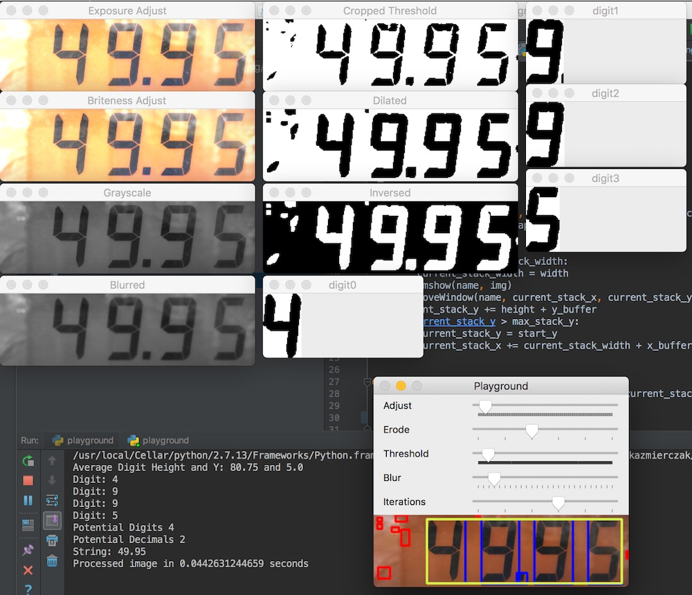

# Gas Pump OCR

Project for attempting to scan pictures of gas pumps and detect the digits in the cost and fuel amount displays. Operating under the assumption that most pumps use a 7 segment digit display.

## Dependencies

* Python
* OpenCV
* NumPy

## Global Setup

* `brew install python` - Using python 2.7.13
* `brew install opencv3` - Using >= OpenCV 3.2.0
* Install the OpenCV package into the python site packages following the instructions from the above command output

## Virtual Env

* `pip install virtualenv` - Install virtualenv if you haven't
* `virtualenv GasPumpOCR_Env` - Create virtual env
* `source GasPumpOCR_Env/bin/activate` - Activate virtual env
* `pip install -r requirements.txt` - Install dependencies
* Write/run the code
* `deactivate` - When you are done and want the global python env

## virtualenvwrapper

[virtualenvwrapper](https://virtualenvwrapper.readthedocs.io/en/latest/index.html) is a nice set of wrappers around virtualenv that make it easier to use

Install and configure virtualenvwrapper

```
pip install virtualenvwrapper
export WORKON_HOME=$HOME/.virtualenvs
source /usr/local/bin/virtualenvwrapper.sh
```

Create new env

```
mkvirtualenv GasPumpOCR_Env
```

Work on a virtual env

```
workon GasPumpOCR_Env
```

Install dependencies

```
pip install -r requirements.txt
```

Deactivate

```
deactivate
```

## Running

* **playground.py [file_name]** - Used to try out different image manipulation variables, can hardcode an image or pass one in via the command line
* **train_model.py** - Used to take a folder organization of confirmed digits and generate a `knn` training file
* **test_processing.py** - Used to run the trained algorithm on a folder of test images to test accuracy, can also be setup to test all the configurations to determine optimal values
* **generate_distorted_images.py** - Used to take an image or a folder and run a set of image manipulations to create addtional sample images

## Screenshot

